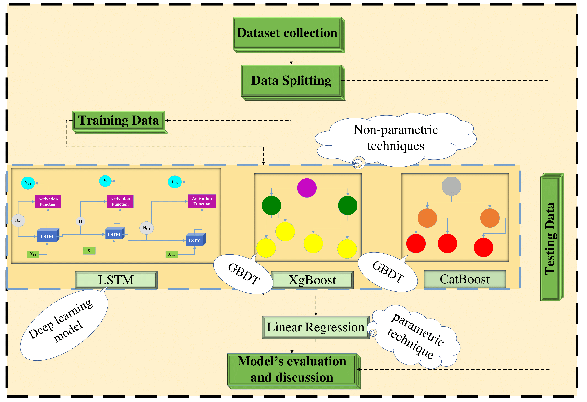

# **DeepBoost-for-EVs-charging-station-load-forecasting**
## Abstract
The emission of Greenhouse Gases (GHGs) is the main cause of climate change and the transportation sector, especially in urban areas, is among the major contributors to these emissions which are putting a big question mark on sustainability. A significant reduction in emissions is possible through widespread adoption of Electric Vehicles (EVs) which can help in addressing the issues of climate change and sustainability. However, the introduction of EVs brings additional load on the existing grid and can adversely affect its operation. Therefore, we presented a novel DeepBoost approach for forecasting day-ahead EVs charging station load. The proposed approach consists of Categorical Boosting (CatBoost), Extreme Gradient Boosting (XgBoost), Long Short-Term Memory Network (LSTM) and Linear Regression (LR) models. The performance of DeepBoost is compared with conventional CatBoost, XgBoost, LSTM, Informers and different hybrid deep learning methodologies and other techniques reported in the literature. The results demonstrate the effectiveness of the DeepBoost over other models. For the dataset of Adaptive Charging Networks (ACN), the Mean Absolute Error (MAE) of DeepBoost improves by 9.4%, 32.7% and 88% as compared to CatBoost, XgBoost and LSTM networks, respectively.
## Image

# Getting Started
Follow the steps below to set up and run the code for short-term global horizontal irradiance forecasting.

## Prerequisites
Ensure you have the following software installed: 
- Python 3.10.9 or above 

Required libraries:  
 -  NumPy 
 -  Pandas 
 -  Scikit-learn 
 -  CatBoost 
 -  Matplotlib 
 -  Seaborn 
 -  TensorFlow 
 -  Keras 
 -  RandomForest 

# Running the Code
## Step 1: Data Preprocessing
Run k-mean_clustering.ipynb script to perform weather-based clustering. 
Run splitting_the_clustering_data.ipynb script to separate respective clusters. 

## Step 2: Model Training and Evaluation

Run the Bidirectional_LSTM.ipynb, GRU.ipynb, CatBoost.ipynb and adaboost.ipynb scripts from respective folders to train and evaluate the weather-classified CatBoost model against benchmark techniques.

## Step 3: Visualization
Run the bar_plot.ipynb, graph.ipynb and scatter_regression_plot.ipynb scripts to visualize the forecasting results and compare the model's performance.

Short-term-Global-Horizontal-Irradiance-Forecasting/  
├── Datasets/                   # Folder for datasets  
├── Weather Calssification/     # Folder containing scripts for data preprocessing and clustering  
├── Simulation for/             # Folder containing scripts for model training and evaluation  
├── Graphicall illustration     # Folder containing scripts for result visualization  
├── README.md                   # Project README file  

## Reference
@article{SIDDIQUI2025331,
title = {Electric Vehicle charging station load forecasting with an integrated DeepBoost approach},
journal = {Alexandria Engineering Journal},
volume = {116},
pages = {331-341},
year = {2025},
issn = {1110-0168},
doi = {https://doi.org/10.1016/j.aej.2024.12.069},
url = {https://www.sciencedirect.com/science/article/pii/S1110016824016673},
author = {Joveria Siddiqui and Ubaid Ahmed and Adil Amin and Talal Alharbi and Abdulelah Alharbi and Imran Aziz and Ahsan Raza Khan and Anzar Mahmood},
keywords = {EVs, Charging load, Integrated method, Data analytics, LSTM, CatBoost, XgBoost, Machine learning},
}
